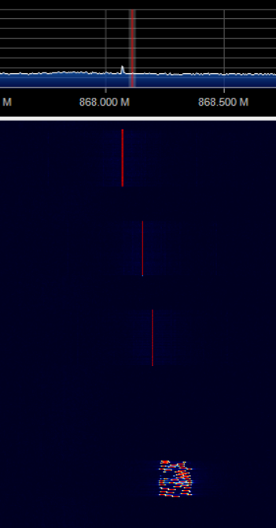

# ST Eval Kit Murata Sigfox Lora- GCC version

This project provides an application example to send both Sigfox and LoraWAN messages in sequence. Both stacks are loaded on the module.

It is based on X-CUBE-SFOX library v1.1.0 and I-CUBE-LRWAN 1.1.2. There is a more recent I-CUBE library (v1.2) but it is using different ST libraries not aligned with Sigfox. Using this previous version allows to merge the code more easily. Merged files between stacks can be found looking for _aureleq_ in the source code. A new function was also added to _LoraMac.c_ file to reset SX1276 after a Sigfox transmission.

**Note: LowPower library has been disabled and the code is not cleaned up yet. Do not hesitate to contribute**

A Makefile was added in order to compile with ARM-gcc and flash the firmware with ST-flash.

It is an alternative to IDE-based examples that allows you to use your preferred code editor and command line tools.

## Requirements

The [GNU Embedded Toolchain for Arm](https://developer.arm.com/open-source/gnu-toolchain/gnu-rm/downloads) must be installed to cross-compile the example.

The tool [ST-flash](https://github.com/texane/stlink) is used to load the firmware, you can install this tool or use the traditional STM32 ST Link Utility.

For Windows users, additional GNU utilities maybe required, especially to interpret the Makefile.
[MSYS](http://www.mingw.org/wiki/msys) is recommended for this usage.

Don't forget to update your PATH variable for all those tools.

If you haven't used your board with Sigfox yet, you will need a bit of soldering first, you can refer to [this other tutorial](https://github.com/aureleq/muRataSigfox). You can also retrieve your Sigfox IDs and Keys following this link.


## Usage

The application example sends periodic messages, first on LoRaWAN and send on Sigfox. The LoraTxData callback is called every `APP_TX_DUTYCYCLE`ms. A Timer is then setup to schedule Sigfox task to send the message.

If you wish to use your Sigfox IDs, your will need to copy first the `sigfox_data.h` file by the one you received, in the following directory: *//Projects/B-L072Z-LRWAN1/Applications/Sgfx/Sgfx_push_button/inc*

For LoraWAN credentials, rename the file *murata_lpwan_gcc\Projects\B-L072Z-LRWAN1\Applications\SgfxLora\SgfxLora_Periodic\inc\Commissioning_template.h*  to *Commissioning.h* and enter your own credentials.

To compile the code:
```
make
```

Flashing the device requires the device to be in bootloader mode. To do so on the eval board, press down the Reset Button while connecting USB cable to your computer (you will see the LED flashing), then release it.
```
make flash
```

Once the device is flashed, messages will be sent periodically on both networks

## Debug

Full debug is activated by default. You can open a terminal to display credentials and transmission details.

Example of a LoraWan and Sigfox transmission:
```
*** seqTx= 16 *****
TX on freq 868500000 Hz at DR 0
txDone
RX on freq 868500000 Hz at DR 0
rxTimeOut
RX on freq 869525000 Hz at DR 0
rxTimeOut
senddata....64 00 00 00 00 00 00 1130s0394 > RF_API_init in TX
1130s0419 > RF at Freq 868107700
1130s0419 > TX START
Start1132s0220 > TX END
1132s0220 > RF_API_stop
1132s0244 > Delay= 1000 ms
1133s0244 > RF_API_init in TX
1133s0269 > RF at Freq 868181400
1133s0269 > TX START
Start1135s0070 > TX END
1135s0070 > RF_API_stop
1135s0094 > Delay= 1000 ms
1136s0094 > RF_API_init in TX
1136s0119 > RF at Freq 868124000
1136s0119 > TX START
Start1137s0944 > TX END
1137s0944 > RF_API_stop
1137s0968 > Delay= 1000 ms
done
```


Below is a capture of Lora and Sigfox signals using AirSpy:


## Next steps

- Cleaning code
- Add LowPower library
